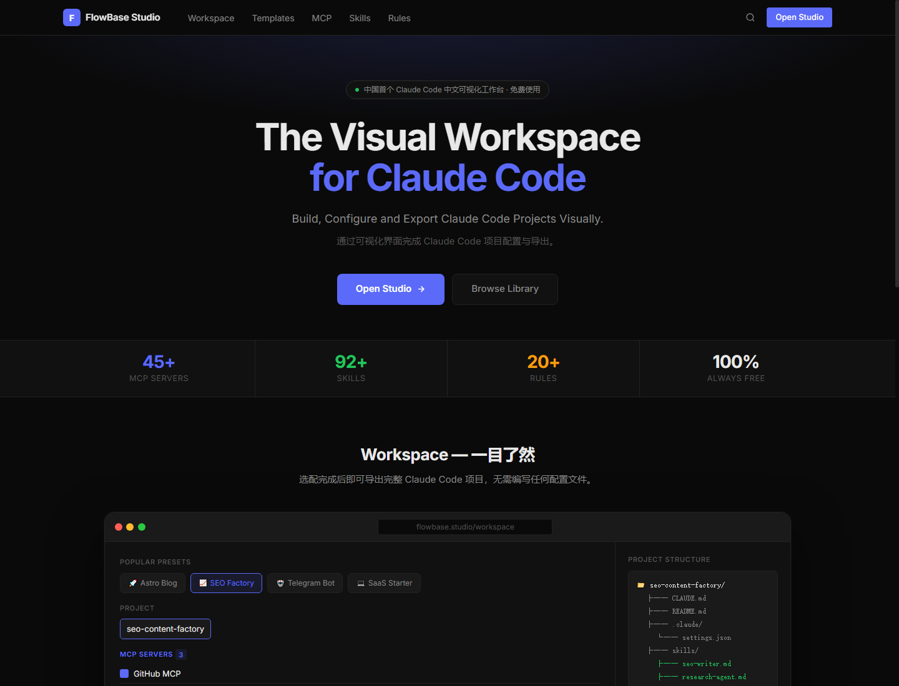
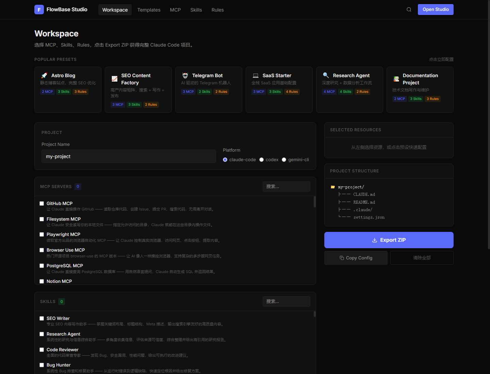
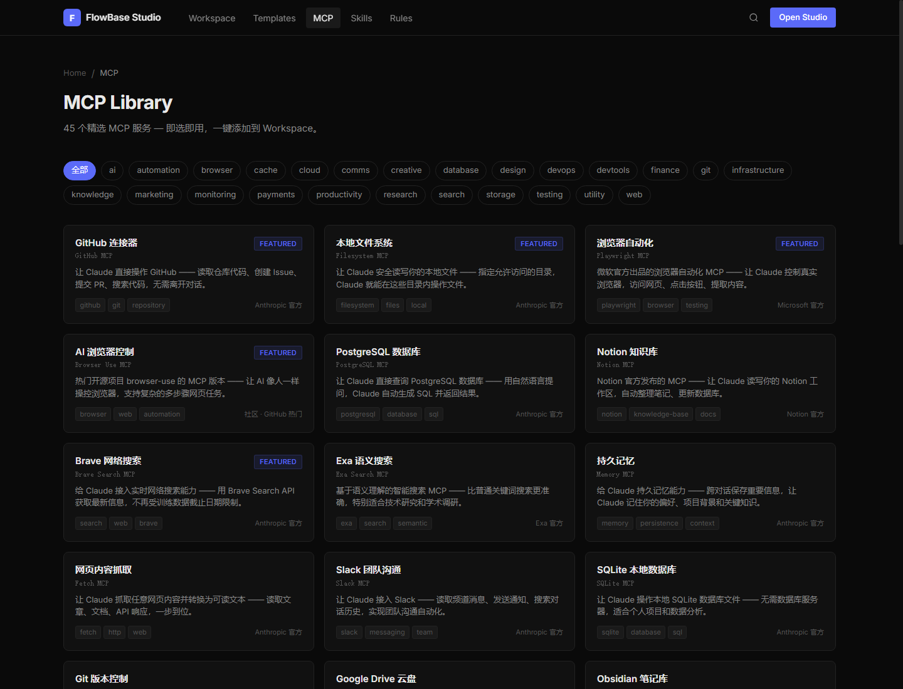

# FlowBase Studio

Claude Code 視覺化工作區。

透過視覺化方式建立、設定並匯出 Claude Code 專案。

[English](./README.md) | [简体中文](./README.zh-CN.md) | [繁體中文](./README.zh-TW.md)

[官網](https://studio.flowbase.com.cn) | [線上演示](https://studio.flowbase.com.cn) | [GitHub](https://github.com/FlowBaseAI/flowbase-studio)

## 專案截圖

## 功能

- Claude Code 視覺化工作區
- MCP 庫
- Skills 庫
- Rules 庫
- 專案範本
- 設定匯出
- 靜態部署

## 為什麼使用 FlowBase Studio

Claude Code 專案通常需要在工作區準備階段設定多個檔案：

- `CLAUDE.md`
- MCP Config
- Skills Files
- Rules Files

FlowBase Studio 將這些設定集中到視覺化介面中，讓團隊可以瀏覽資源庫、設定專案，並匯出可直接使用的設定檔。

## 技術棧

- Astro
- TypeScript
- TailwindCSS
- MDX
- Pagefind

## Roadmap

- Workspace
- MCP Library
- Skills Library
- Rules Library
- Templates
- Marketplace
- Local Workspace Sync

## 貢獻

Owner: Kinglee5525

Organization: FlowBaseAI

歡迎貢獻。請保持改動聚焦、說明清楚，並遵循專案結構。

## License

MIT
